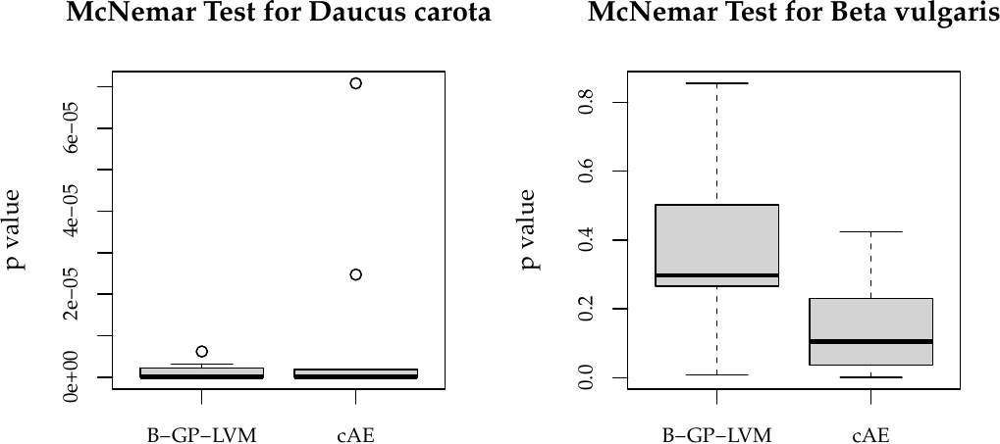
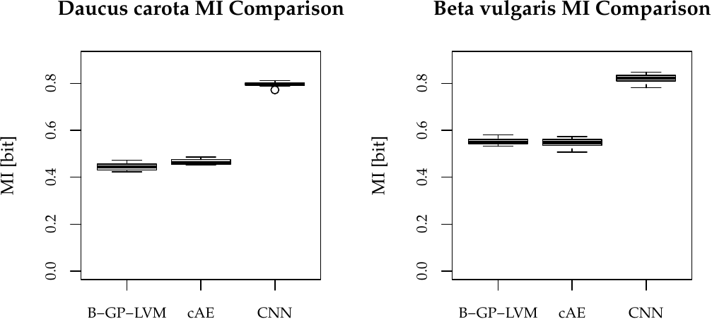
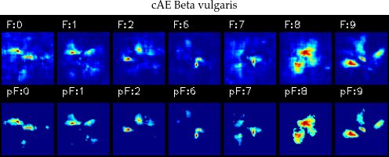

# Plant_Unsupervised

This repository contains the software for our paper "Investigating Explanatory Factors of Machine Learning Modelsfor Plant Classification". 
We provide an installation script, which installs all needed Python libraries. Note, this repository is based and ws tested under:

- Ubuntu 20.04
- CUDA 11.2 and Tensorflow2
- Python 3.8
- R 4.1.0

If you are using our software, please cite [our work](https://www.mdpi.com/2223-7747/10/12/2674).

# Installation

Please use the bash script provided to install the used software. 
Note, that R is not installed in this way.
This repository is heavily based on the [NVIDIA docker container](https://github.com/NVIDIA/nvidia-docker) and [machine learning docker container](https://github.com/nielsborie/ml-docker).
Docker is not mandaroty but it will simplify the processing.

To install the used software, please run the *install.bash* script with the *-I* and *-i* flag. 
This will result in two virtual environments in the Python folder. 
If there was any error, you can check the log files in the Python folder.

# Usage of This Software

This repository is organized using the following folder structure:

- **Python:** This folder contains the installation scripts, the Python VEs as well as some main processing scripts such as B-GP-LVM classes
- **data:** Run the scripts in this folder to generate the images (CNN and cAE) and training csv files (B-GP-LVM)
- **Autoencoder:** Rund the bash script in this folder to train several convolutional autoencoder.
- **GPLVM:** Run both bash scripts to estimate the latent data representation as well as the heatmaps for the latent space.
- **results:** Some results for this README file
- **Analysis:** The statistical analysis of the estimated models
    - Autoencoder: Autoencoder code selection
    - Classification: CNN, CNN visualization (LRP+Sykacek's sampling), SVM including global optimization, index creation for McNemar test as well as model comparison scripts.
    - FeatureSelection: Relevance based features selection R script
    - FeatureViz: Visualization scripts
    - Prediction: Prediction of the features of the estimated optimal unsupervised models

# Results
Some selected results are available in the ''results'' folder.
You can see the prediction performance comparison in the following figures.

We see, that the CNN outperforms the other classification methodologies.
However, we can analyse the resons for CNN classification using LRP and [Sykacek's sampling method for saliency maps](https://github.com/TW-Robotics/NT_BodyParts).

In contrast to that, the B-GP-LVM as well as cAE features can be visualized before classification.

